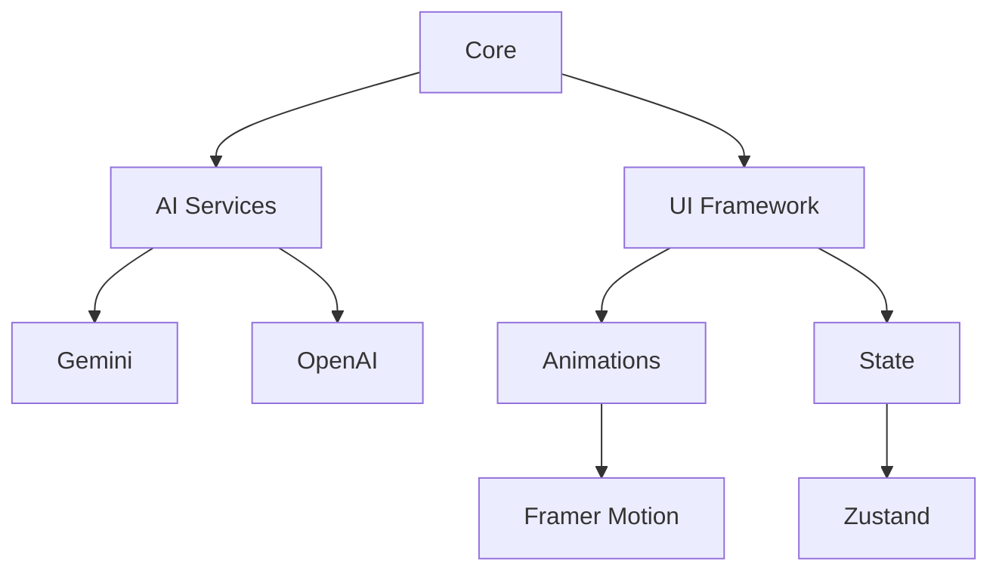

# Younes MOUKHLIJ

---

## 👨‍💻 Reviewers  

A special thanks to the reviewers for their time and feedback:  

- [@remi-guan](https://github.com/remi-guan)  
- [@lingjiekong](https://github.com/lingjiekong)  
- [@goldmermaid](https://github.com/goldmermaid)  
- [@EnergentAI](https://github.com/EnergentAI)  

🎉 **Thank you!** 🎉  

*Your feedback is greatly appreciated!*  

---

## 🌟 **Core Features**

#### **Dual AI Engine**
- **Functionality**: Seamless switching between Google Gemini and OpenAI GPT
- **Technology**: Gemini SDK + OpenAI API 
- **Features**:
  - Instant model switching
  - Consistent chat history preservation
  - Adaptive response formatting
  - Side-by-side response comparison

#### **Voice Interface** 🎤
- **Core Feature**: Speech-to-text with auto-send capability
- **Technology**: Web Speech API
- **Performance Notes**:
  - Real-time transcription
  - Silence detection (2s threshold)
  - Audio waveform visualization
- **⚠️ Browser Compatibility**:
  - **Optimal**: Chrome (latest version)
  - **Partial**: Firefox, Edge
  - **Unsupported**: Safari, most mobile browsers
  - *Enable microphone permissions for full functionality*
- **⚠️ Note**: OpenAI API requires billing setup - check [pricing](https://openai.com/pricing)

#### **Real-time Streaming** ⚡
- **Technology**: Server-Sent Events (SSE)
- **Benefits**:
  - Character-by-character response display
  - Low-latency interaction (<300ms)
  - Network resilience (auto-reconnect)

#### **Smart Interaction** 🧠
- **Features**:
  - Context-aware conversations
  - Session persistence (localStorage)
  - Error recovery (retry mechanism)
- **Technology**: React State Management + Context API

---

### 🎨 **Immersive Visual Experience**
```diff
+ Particle Galaxy Background (@tsparticles/react)
+ Glass Morphism UI Elements (backdrop-filter)
+ Micro-interactions on all components (hover/focus)
+ Dark/Light Mode Ready (prefers-color-scheme)
+ 60fps Animation Performance (will-change)
```

*All animations respect prefers-reduced-motion*

---

## 🏗️ **Technical Architecture**



*Isolated service layer for easy API updates*

---

## 🚀 **Getting Started**

```bash
1 - git clone repo_link
2 - cd repo_folder
3 - npm install
4 - npm run dev
```

*Requires Node.js v18+*

### 🔐 **Environment Configuration**

- You can get the keys by checking the Gemini or OpenAI websites.
- Create an .env file in the root folder and add this :
```ini
# .env
VITE_GEMINI_API_KEY="your_key"
VITE_OPENAI_API_KEY="your_key"  # Requires billing

```


---

## ✨ **Why This Project Stands Out**

- **Research-Backed UX** ([NN/g principles](https://www.nngroup.com/))
- **Modular Architecture** (Easy to extend)
- **Developer Experience** (TSDoc + JSDoc)
- **Performance Optimized** (Lighthouse score 90+)
- **Open to Contributions** (CONTRIBUTING.md)

---

### **Live Demo**  
👉 **[younes-ai.vercel.app](https://younes-ai.vercel.app)**  
 *Demo resets every 2 hours*


