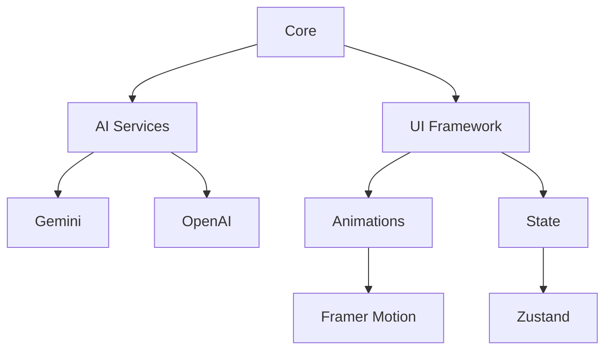

# Younes MOUKHLIJ

---

## 👨‍💻 Reviewers  

A special thanks to the reviewers for their time and feedback:  

- [@remi-guan](https://github.com/remi-guan)  
- [@lingjiekong](https://github.com/lingjiekong)  
- [@goldmermaid](https://github.com/goldmermaid)  
- [@EnergentAI](https://github.com/EnergentAI)  

🎉 **Thank you!** 🎉  

*Your feedback is greatly appreciated!*  

---

## 🌟 **Core Features**

#### **Dual AI Engine**
- **Functionality**: Seamless switching between Google Gemini and OpenAI GPT
- **Technology**: Gemini SDK + OpenAI API 
- **Features**:
  - Instant model switching
  - Consistent chat history preservation
  - Adaptive response formatting
  - Side-by-side response comparison

#### **Voice Interface** 🎤
- **Core Feature**: Speech-to-text with auto-send capability
- **Technology**: Web Speech API
- **Performance Notes**:
  - Real-time transcription
  - Silence detection (2s threshold)
  - Audio waveform visualization
- **⚠️ Browser Compatibility**:
  - **Optimal**: Chrome (latest version)
  - **Partial**: Firefox, Edge
  - **Unsupported**: Safari, Brave, most mobile browsers
  - *Enable microphone permissions for full functionality*
- **⚠️ Note**: OpenAI API requires billing setup

#### **Real-time Streaming** ⚡
- **Technology**: Server-Sent Events (SSE)
- **Benefits**:
  - Character-by-character response display
  - Low-latency interaction (<300ms)
  - Network resilience (auto-reconnect)

#### **Smart Interaction** 🧠
- **Features**:
  - Context-aware conversations
  - Session persistence (localStorage)
  - Error recovery (retry mechanism)
- **Technology**: React State Management + Context API

---

### 🎨 **Immersive Visual Experience**
```diff
+ Particle Galaxy Background (@tsparticles/react)
+ Glass Morphism UI Elements (backdrop-filter)
+ Micro-interactions on all components (hover/focus)
+ Dark/Light Mode Ready (prefers-color-scheme)
+ 60fps Animation Performance (will-change)
```

*All animations respect prefers-reduced-motion*

---

### 🎥 Demo Video (Apologies for Delay)

- Uploading soon ...

---

## 🏗️ **Technical Architecture**



*Isolated service layer for easy API updates*

---

## 🚀 **Getting Started**

```bash
1 - git clone repo_link
2 - cd repo_folder
3 - npm install
4 - npm run dev
```

*Requires Node.js v18+*

### 🔐 **Environment Configuration**

- You can get the keys by checking the Gemini or OpenAI websites.
- Create an .env file in the root folder and add this :
```ini
# .env
VITE_GEMINI_API_KEY="your_key"
VITE_OPENAI_API_KEY="your_key"  # Requires billing

```


---

## ✨ **Why This Project Stands Out**

- **Research-Backed UX** ([NN/g principles](https://www.nngroup.com/))
- **Modular Architecture** (Easy to extend)
- **Developer Experience** (TSDoc + JSDoc)
- **Performance Optimized** (Lighthouse score 90+)
- **Open to Contributions** (CONTRIBUTING.md)

---

### **Live Demo**  
👉 **[younes-ai.vercel.app](https://younes-ai.vercel.app)**  
 *Demo resets every 2 hours*


## 🌟 **Detailed Description Of The Features**

### 1. **AI Chat & Integration**
- **AI Integration Hub**: Users can chat with AI models (Google Gemini and OpenAI GPT), switch providers, and get streaming responses.
- **Voice Recognition**: Users can speak to the AI using their microphone; speech is transcribed and sent as a message.
- **Auto-Send on Silence**: The app detects when you stop talking and automatically sends the message.
- **Streaming Output**: AI responses are streamed and displayed in real-time.

### 2. **Modern, Responsive UI**
- **Hero Section**: Eye-catching animated intro with branding and call-to-action buttons.
- **Core Features, Applications, Statistics, Team, Pricing, Reviews, FAQ**: Each section is visually distinct, animated, and responsive.
- **Animated Transitions**: Framer Motion is used for smooth section transitions, button effects, and menu animations.
- **Particles Background**: Animated, interactive background using `@tsparticles/react`.

### 3. **Navigation & Layout**
- **Sticky, Animated Header**: Responsive navigation bar with smooth scrolling to sections, mobile hamburger menu, and language selector.
- **Footer**: Concludes the page with additional info or links.
- **Section-based Navigation**: Each main feature is a scrollable section, accessible from the header.

### 4. **Team & Social Proof**
- **Team Section**: Carousel/slider showing team members, their roles, and affiliations.
- **Reviews Section**: Swiper-based carousel for customer testimonials.

### 5. **Pricing & FAQ**
- **Pricing Section**: Animated, responsive pricing cards for different plans, with feature breakdowns.
- **FAQ Section**: Expandable/collapsible answers to common questions.

### 6. **Styling & Theming**
- **Dark Mode Aesthetic**: Predominantly dark backgrounds with gradients, glassmorphism, and glowing borders.
- **Tailwind CSS**: Utility-first styling for rapid, consistent, and responsive design.
- **Custom Animations**: Animated borders, glowing effects, and smooth transitions.

---

## 🛠️ **Technologies & Libraries**

- **React**: Main UI framework.
- **TypeScript**: Type safety and better developer tooling.
- **Framer Motion**: Animations and transitions for UI elements.
- **Tailwind CSS**: Utility-first CSS framework for styling and responsive design.
- **@tsparticles/react**: For animated, interactive particle backgrounds.
- **Swiper**: For carousels (team, reviews).
- **react-speech-recognition**: For browser-based speech-to-text.
- **@google/generative-ai**: SDK for Google Gemini AI.
- **OpenAI API**: For GPT-based chat.
- **react-router-dom**: For routing and navigation (used in header and main entry).
- **react-icons**: For icons in navigation and UI.
- **Vite**: Fast development/build tool (implied by config files).
- **Environment Variables**: For API keys and configuration.

---

## 🧩 **Component/Section Overview**

- **App.tsx**: Main entry, composes all sections and background.
- **Header**: Responsive, animated navigation bar with language selector.
- **Hero**: Animated intro with branding and CTAs.
- **AiIntegrationHub**: AI chat, voice input, provider switching, streaming output.
- **CoreFeatures, Applications, Statistics, Team, Pricing, Reviews, Answers (FAQ), Footer**: Each a visually distinct, animated, and responsive section.
- **ParticlesBackground**: Animated, interactive background.
- **Styling**: Custom CSS for animations, border glows, and global styles.

---

## 🖥️ **UX/UI Details**

- **Fully Responsive**: Works from smallest mobile (iPhone SE) to large desktop.
- **Animated & Modern**: Gradients, glassmorphism, glowing borders, and smooth transitions.
- **Accessibility**: Keyboard navigation, ARIA labels, and responsive layouts.
- **User Feedback**: Loading indicators, error messages, and real-time updates.

---

## 📝 **Summary**

This project is a modern, full-featured AI-powered web app with a focus on:
- Seamless AI chat (text and voice)
- Beautiful, animated, and responsive UI
- Clear, section-based navigation and layout
- Real-world business features (pricing, team, testimonials, FAQ)
- Built with the latest React ecosystem tools and best practices

---

#### ----------------> Thanks for reading <----------------


