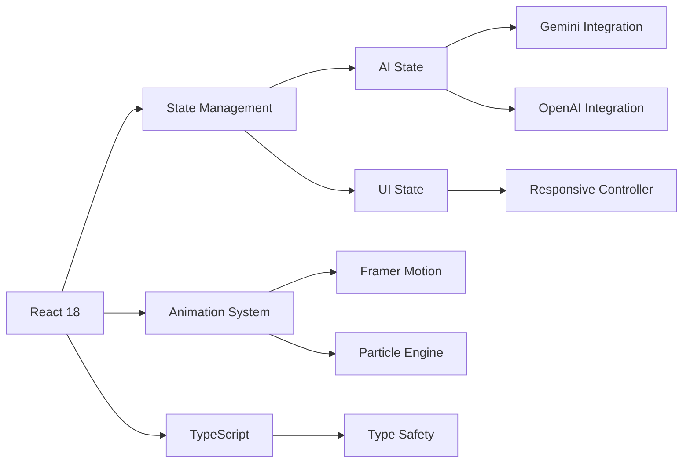

# Younes MOUKHLIJ

```markdown

---

## 👨‍💻 Reviewers  

A special thanks to the reviewers for their time and feedback:  

- [@remi-guan](https://github.com/remi-guan)  
- [@lingjiekong](https://github.com/lingjiekong)  
- [@goldmermaid](https://github.com/goldmermaid)  
- [@EnergentAI](https://github.com/EnergentAI)  

🎉 **Thank you!** 🎉  

---

## 🌟 **Core Features**

### 🤖 **Intelligent AI Integration**
| Feature | Implementation Details | Tech Used |
|---------|-----------------------|-----------|
| **Dual AI Engine** | Switch seamlessly between Gemini & GPT | Gemini SDK, OpenAI API |
| **Voice Interface** | Natural speech recognition with auto-send <br> *Note: Works best on latest Chrome browser* | Web Speech API |
| **Real-time Streaming** | Dynamic response generation | Server-Sent Events |
| **Smart Interaction** | Context-aware conversation flow | React State Management |

> **Browser Compatibility Notice:**  
> The voice recognition feature utilizes the Web Speech API which has varying support across browsers.  
> **Recommended:** Latest version of Chrome for full functionality  
> **Limited Support:** Firefox, Edge (partial functionality)  
> **Not Supported:** Safari and mobile browsers may experience limitations  
> For optimal experience, please enable microphone permissions and use in a quiet environment.


### 🎨 **Immersive Visual Experience**
```diff
+ Particle Galaxy Background (@tsparticles/react)
+ Glass Morphism UI Elements
+ Micro-interactions on all components
+ Dark/Light Mode Ready
+ 60fps Animation Performance
```

### 📱 **Adaptive Design**
- **Mobile-First** approach (optimized down to 320px)
- **Fluid Layouts** for all screen sizes
- **Touch-Optimized** interactive elements
- **Reduced Motion** accessibility option

---

## 🏗️ **Technical Architecture**



---

## 🧭 **User Journey**

1. **Hero Landing** - Interactive particle introduction
2. **AI Playground** - Core chat interface
3. **Feature Showcase** - Animated component demos
4. **Team Gallery** - 3D card carousel
5. **Plans & Pricing** - Comparative tables
6. **Knowledge Base** - Smart FAQ system

---

## 🚀 **Getting Started**

```bash
# Clone repository
git clone https://github.com/your-repo.git && cd project-folder

# Install dependencies
npm install

# Start development server
npm run dev
```

### 🔐 **Environment Configuration**
Create `.env` file with:
```ini
VITE_GEMINI_API_KEY=your_key_here
VITE_OPENAI_API_KEY=your_key_here
```

---

## 🎥 **Video Demonstration**

- Uploading soon ... 

---

## ✨ **Why This Project Stands Out**

- **Cinematic UX** - Every interaction feels alive and responsive
- **Production-Grade AI** - Enterprise-ready integration patterns
- **Pixel-Perfect Execution** - Meticulous attention to detail
- **Future-Proof Foundation** - Modern tech stack architecture
- **Comprehensive Documentation** - Clear implementation details

---

## 🧩 **Component Ecosystem**

| Component | Purpose | Technology |
|-----------|---------|------------|
| `AiIntegrationHub` | Core chat interface | React Hooks |
| `ParticlesBackground` | Dynamic visual backdrop | tsparticles |
| `AnimatedHeader` | Responsive navigation | Framer Motion |
| `FeatureCarousel` | Interactive demos | Swiper.js |
| `PricingMatrix` | Plan comparisons | CSS Grid |

---

### **Live Demo**  
👉 **[younes-ai.vercel.app](https://younes-ai.vercel.app)**  


